# Architecture Diagrams: ACCA AA AI Marker

This document contains 12 improved architecture diagrams for the platform.

## 1) System Context (C4)

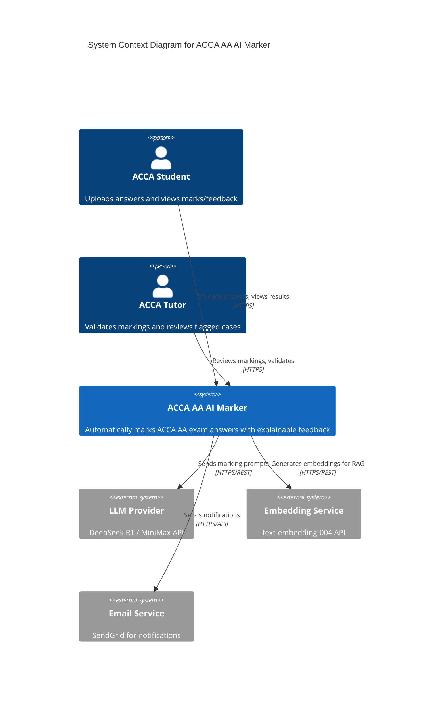

## 2) Container Diagram (C4)

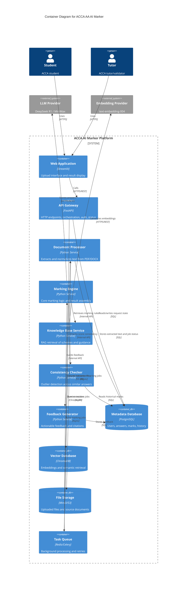

## 3) Marking Engine Components (C4)

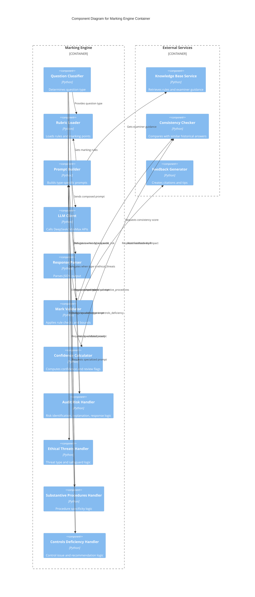

## 4) Sequence Diagram (Upload to Result)

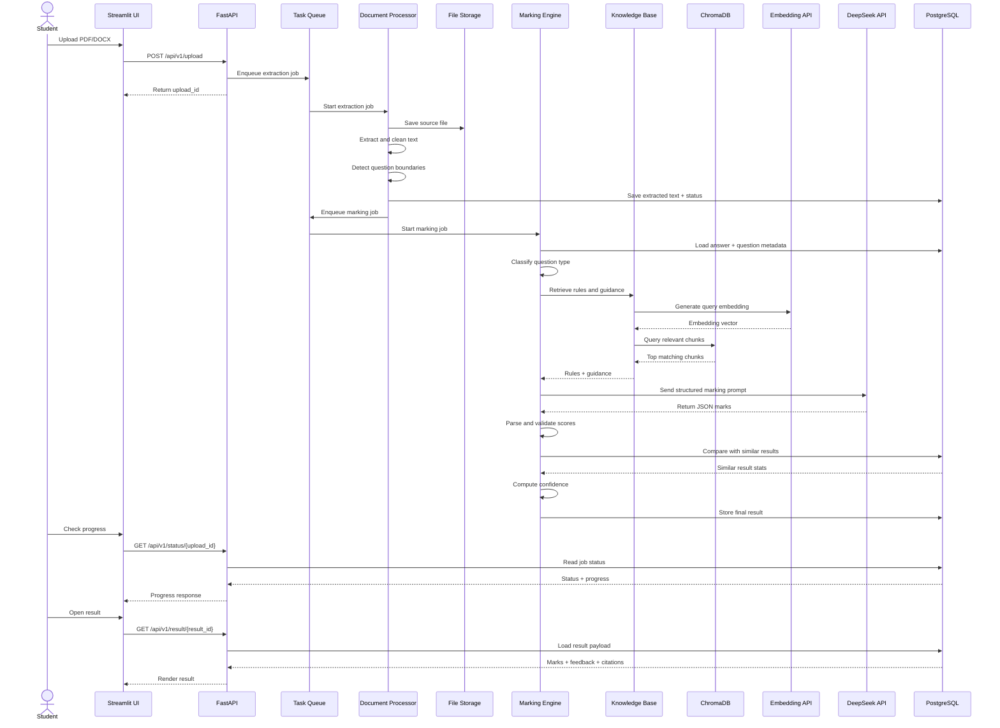

## 5) Data Flow Diagram

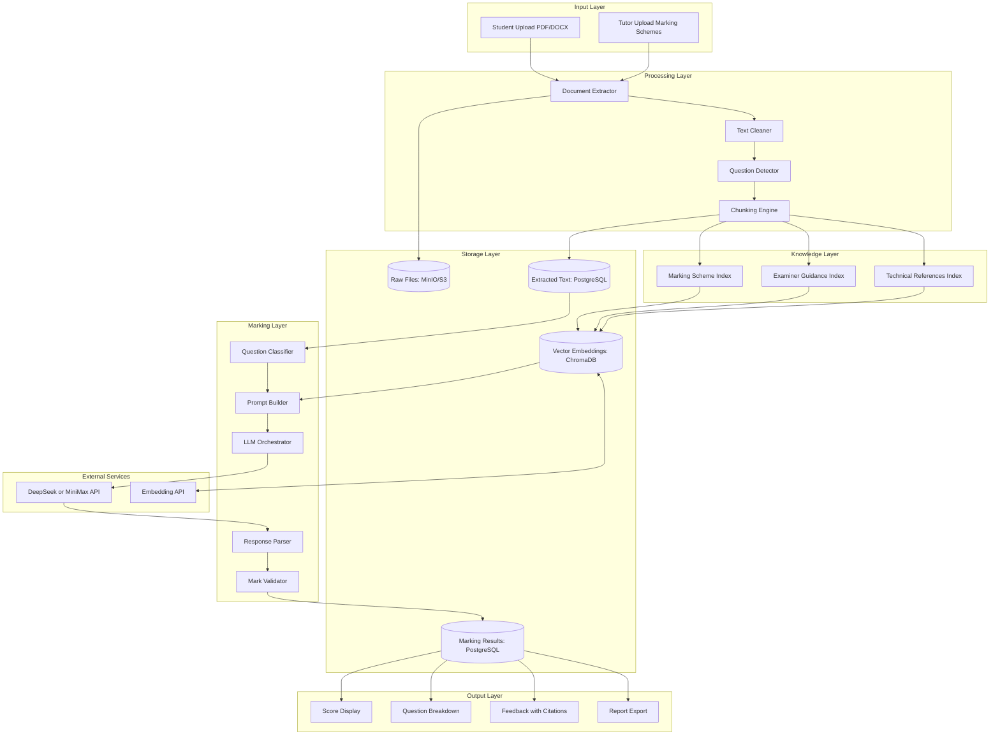

## 6) Deployment Diagram (Runtime Topology)

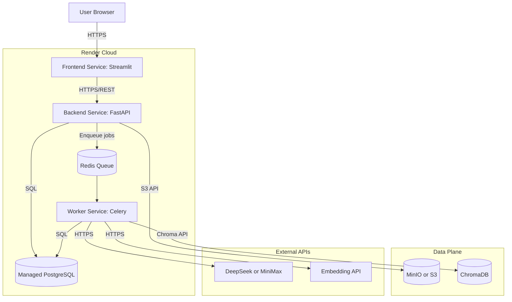

## 7) Component Interaction Diagram

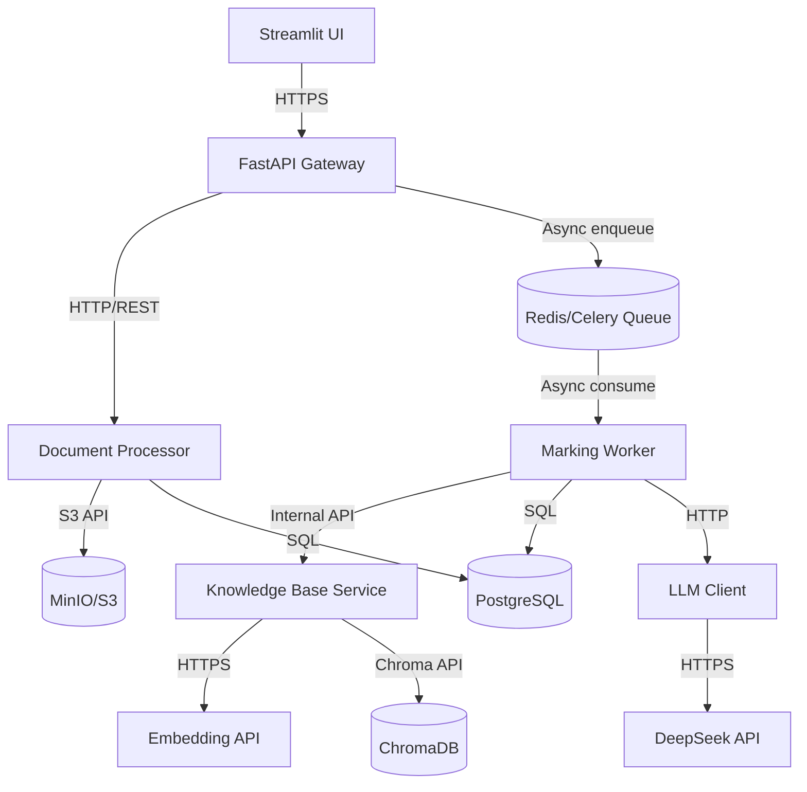

## 8) Processing State Machine

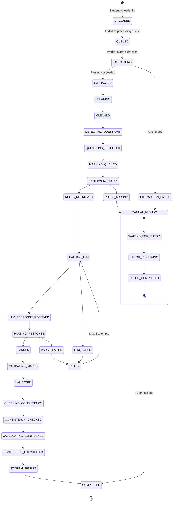

## 9) Database Schema (ER)

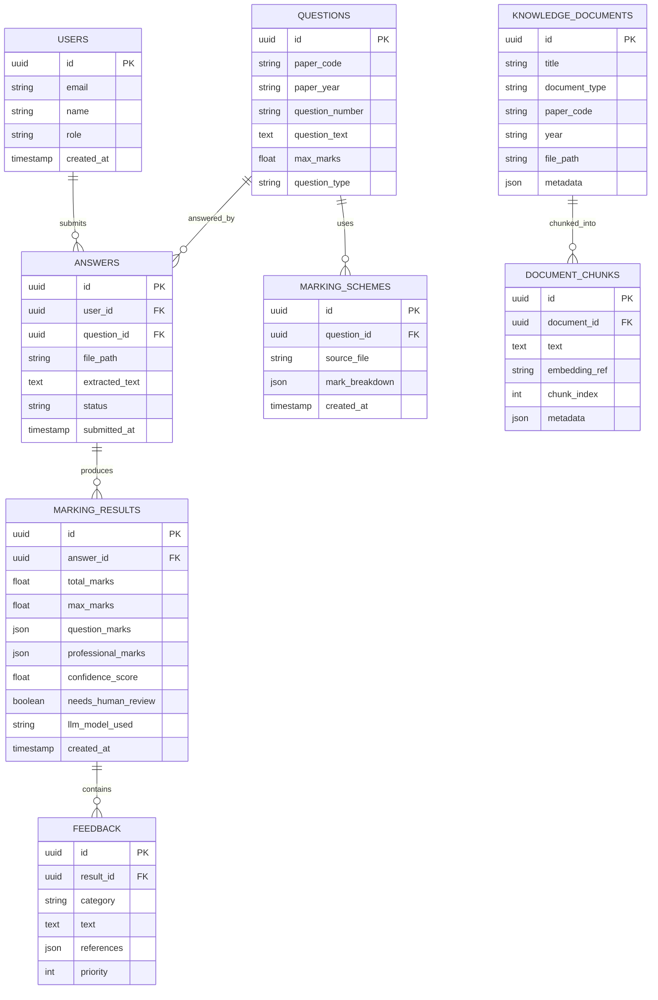

## 10) Tech Stack Diagram

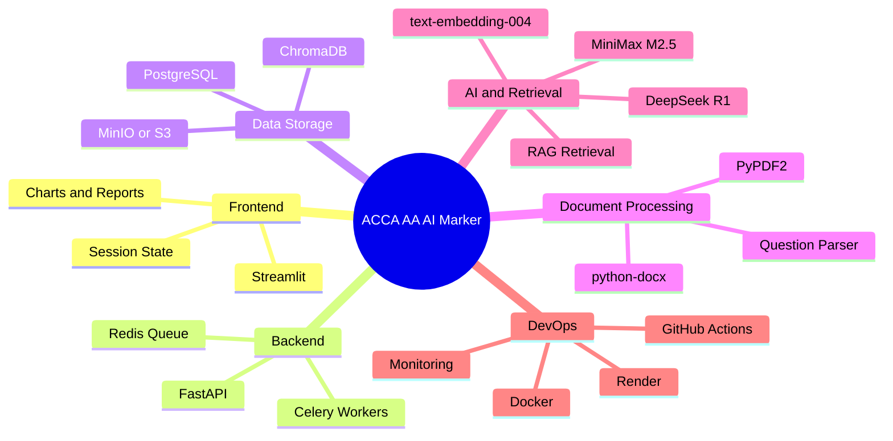

## 11) Security Architecture

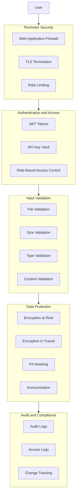

## 12) Monitoring and Observability

```mermaid
flowchart LR
    subgraph Sources[Telemetry Sources]
        API[API Logs]
        LLM[LLM Call Metrics]
        APP[Application Metrics]
        DB[Database Metrics]
    end

    subgraph Collection[Collection Layer]
        PROM[Prometheus]
        LOKI[Loki]
        OTEL[OpenTelemetry]
    end

    subgraph Storage[Storage Layer]
        TSDB[Time-Series Store]
        LOGS[Log Store]
        TRACES[Trace Store]
    end

    subgraph Viz[Visualization]
        GRAF[Grafana]
        DASH[Dashboards]
        ALERT[Alertmanager]
    end

    subgraph Notify[Alert Destinations]
        EMAIL[Email]
        SLACK[Slack]
        PAGER[PagerDuty]
    end

    Sources --> Collection
    Collection --> Storage
    Storage --> Viz
    Viz --> Notify
```
